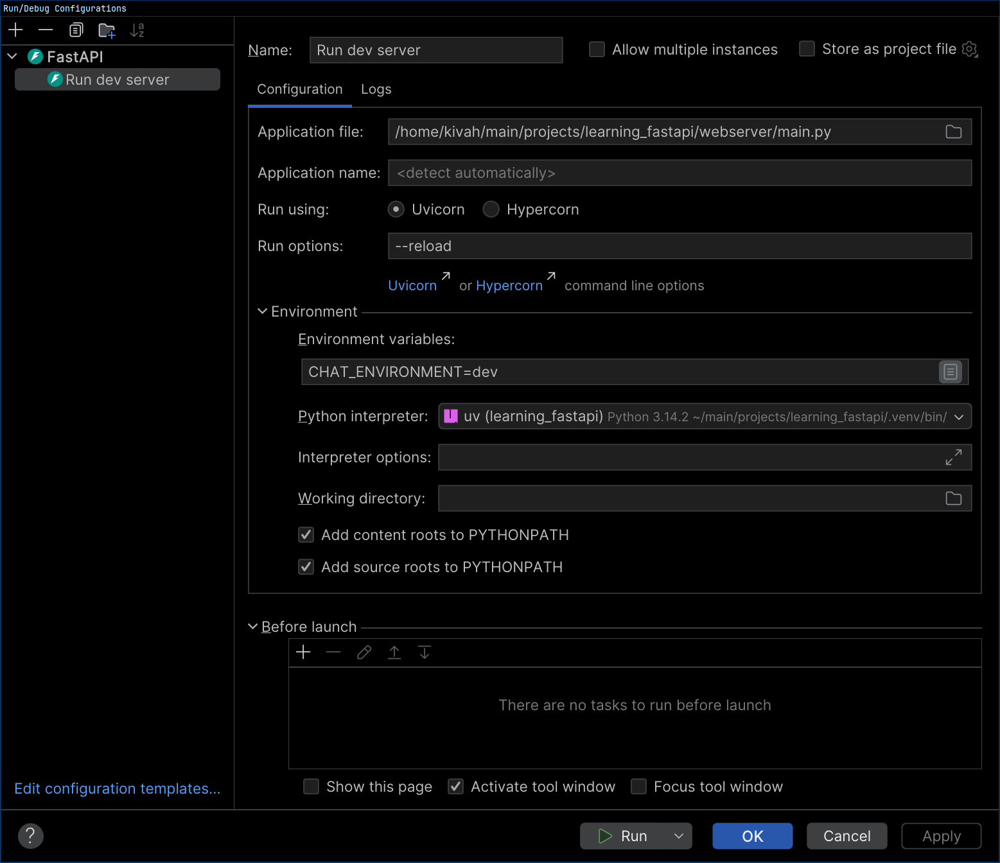

## Running (non-Windows)
```
CHAT_ENVIRONMENT=dev uv run uvicorn "webserver.main:app" --reload
```

<details>
<summary>Running inside PyCharm (click to expand)</summary>
If you are using PyCharm, you can create a run configuration like this:

In the Run/Debug Configurations menu, click `+` and select FastAPI.\
Now set the fields so that they look something like this:

</img>
</details>

## Problems / TODO
- Make a frontend
- Our message timestamps are too fine-grained e.g. `"timestamp": "2026-01-29T23:08:17.372220"`
- We should include a self-reported sent-time timestamp from the client in messages
- No authentication
- Server data is kept in a .json file called `server.json`
- Might be missing global keyword for the chats mutex... Need to look into it
- Make a `routers/` folder, like FastAPI suggests [here](https://fastapi.tiangolo.com/tutorial/bigger-applications/). Currently, all routes are defined in `webserver/main.py`
- Stop using chat_ids for invite codes.. We want something simple like `a84n3a12`. Then we'd want expirations on those cause of the small space

## A silly bug in uvicorn
[FastAPI](https://github.com/fastapi/fastapi/discussions/7858) uses [starlette](https://github.com/Kludex/starlette/issues/826#issuecomment-593124738) which uses [uvicorn](https://github.com/Kludex/uvicorn/blob/main/uvicorn/protocols/http/httptools_impl.py#L258) which improperly handles percent-encoded forward slashes like `%2F` as _actual_ path separators...

You can try this with any website that uses FastAPI. Just replace all but the first `/` with a `%2F`, e.g.

Original URLs:
- https://ponte.energy/images/p/img_3414-320.webpl
- https://boostry.co.jp/tag/tech

Broken percent encoding that shouldn't work, but does:
- https://ponte.energy/images%2fp%2fimg_3414-320.webp
- https://boostry.co.jp/tag%2ftech
